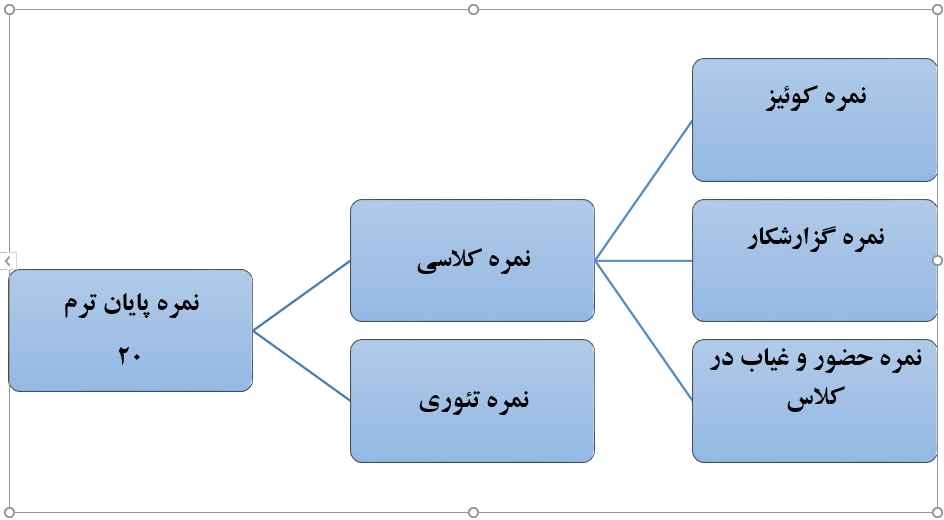

**آیین نامه انضباطی و مقررات آزمایشگاه فارماکوگنوزی**

لطفا قوانین ذیل را به دقت مطالعه کنید

1- همیشه راس ساعت مقرر در آزمایشگاه حضور یابید. تاخیر در ورود سبب از دست دادن نمره کوئیز و علاوه بر آن کسر 0.25 بابت تاخیر خواهد شد

2- در ابتدای هر جلسه می بایست آمادگی لازم برای کوئیز از موضوع همان جلسه یا جلسه قبل را داشته باشید.

3- در حین برگزاری آزمیشگاه به هیچ عنوان بدون اطلاع به کارشناس آزمایشگاه کلاس را ترک نکنید. در غیر اینصورت غیبت در آن جلسه منظور می گردد.

4- همواره در آزمایشگاه **روپوش سفید با دکمه‌های بسته** به تن داشته باشید و از آوردن لباس‌های دیگر به آزمایشگاه خودداری نمایید.

5- در حین انجام آزمایش حتما **<u>عینک ایمنی</u>** به چشم داشته باشید. آزمایشگاه عینک ایمنی در اختیارتان قرار می‌دهد. در صورت تمایل، عینک ایمنی مخصوص خودتان را به همراه داشته باشید، در غیر این صورت عواقب آن متوجه خودتان می‌باشد.

6- در طول کار با شعله حتما **توری و سه پایه** را بر روی آن قرار دهید و به هیچ عنوان شعله‌ی گاز را بدون سه پایه و توری به تنهایی رها نکنید و در پایان کار شیر گاز را ببندید در غیر این صورت عواقب آن ناشی از آتش‌سوزی و سوختگی و یا هر گونه خسارت مالی و جانی به عهده خودتان می‌باشد.

7- ظروف آزمایشگاهی در سبدی که با شماره گروهتان مشخص شده است را به دقت بررسی نموده و در پایان کار تمیز، شمارش شده، سالم و مرتب تحویل دهید. بدیهی است عدم رعایت این موضوع سبب ثبت وسیله شکسته شده برای تمامی اعضاء گروه و کسر نمره عملی آزمایشگاه خواهد شد.

8- میز کار در اتمام آزمایش می‌بایست تمیز و خشک تحویل داده شود و صندلیها را در زیر میز قرار دهید.

9- پس از استفاده از پودرهای گیاهی و صاف نمودن آن‌ها را در سبد کوچک داخل سینک قرار داده و به هیچ عنوان حلال‌های آلی و معدنی را در سینک نریزید و از ظرف‌های بازیافتی که در کنار سینک هر میز قرار داده شده استفاده نمایید.

10- مواد آلی مضر و اسیدهای قوی مورد نیاز هر جلسه آزمایشگاه همواره در زیر هود قرار داشته و به هیچ عنوان ظروف مربوطه را از زیر هود خارج نکنید و در هنگام کار با اسیدهای قوی دقت لازمه را داشته باشید.

11- در صورت نیاز به دستکش، دستکش مخصوص آزمایشگاه مورد نیاز خود را به همراه داشته باشید، در غیر این صورت هیچ گونه مسئولیتی بابت سوختگی ناشی از اسید و حرارت متوجه آزمایشگاه و کارشناسان مربوطه نمی‌باشد.

12- از خوردن و آشامیدن و دویدن و شوخی‌های نامتعارف در آزمایشگاه خودداری نمایید.

13- نیاز به نوشتن گزارشکار در هر جلسه آزمایشگاه نمی‌باشید و در هر جلسه کارشناسان آزمایشگاه در صورت نیاز به گزارشکار اطلاع می‌دهند.

14- گزارشکارها بنا به خواست خودتان گروهی یا انفرادی نوشته می‌شود.

15- در انتهای صحبت‌های استاد و اتمام آزمایش حتما صندلی‌ها را در جایگاه اولیه آن قرار دهید.

**اینجانبان مطالب فوق را به دقت مطالعه نموده و متعهد به رعایت آن‌ها می‌باشیم.**

**فرمت گزارشکار آزمایشگاه فارماکوگنوزی**

1- عنوان آزمایش تاریخ:

اسامی گروه: جلسه:

2- شرح کار عملی (روش کار)

3- پاسخ به سوالات مطرح شده توسط اساتید و کارشناس آزمایشگاه

4- محاسبات

5- ضمیمه کردن کاغذهای کروماتوگرافی در صورت لزوم

**نحوه محاسبه نمره پایان ترم:**

