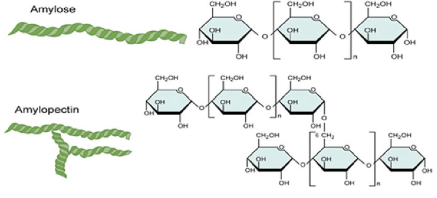
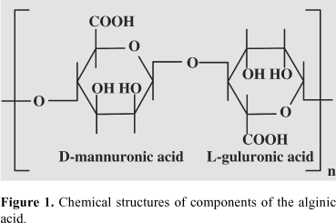

**کربوهیدرات ها**

**مقدمه**

کربوهیدرات‌ها یا قندها موقعیت خاص در متابولیسم گیاهان دارند و از این نظر روش‌هایی که جهت تجسس و تعیین مقدار آن‌ها به کار می‌رود دارای اهمیت زیادی می‌باشند. مواد قندی حاصل واکنش‌های فتوسنتز بوده و ترکیبات غامضی را تشکیل می‌دهند. قندها وسیله‌ای جهت ذخیره انرژی (نشاسته)، انتقال انرژی (به صورت ساکارز) و تشکیل دهنده جدار سلول‌های گیاهی (سلولز) می‌باشند. این اجسام موادی بی‌رنگ هستند و می‌توان آن‌ها را با معرف‌های رنگی تشخیص داد.

قندهای احیاء کننده مانند گلوکز را عملا از روی تولید رسوب زرد- قرمز با محلول فهلینگ تشخیص می‌دهند.

قندهایی که در داروسازی به کار می‌روند عبارتند از نشاسته و فرآورده های حاصله، اینولین، فرآورده‌های سلولز، پلی اورونیدها (شامل آلژینات‌ها، صمغ‌ها، موسیلاژها و آگار) و عسل.

**عسل**: از قندهای تغییر یافته (مخلوطی از نسبت مساوی گلوکز و فروکتوز حاصل از هیدرولیز ساکارز) تشکیل شده است.

سایر فرآورده‌های یاد شده فوق، از پلی ساکاریدها می‌باشند.

**نشاسته**: 80 درصد نشاسته را آمیلوپکتین (اتصالات گلوکزی از طریق آلفا- 1، 4 و آلفا1-6) و 20درصد آن را آمیلوز تشکیل می‌دهد.

**اینولین**: یک پلیمر فروکتوز است.

**سلولز**: از اتصالات مولکول‌های گلوکز که از طریق بتا- 1، 4 متصلند تشکیل یافته است.

**پلی اورونیدها:** پلی ساکاریدهایی هستند که بعضی از مونرمرها را اسید اورانیک تشکیل می‌دهد. پلی اورونیدهای طبیعی از املاح این اسیدها تشکیل یافته اند.

**آلژینات‌ها:** از گونه‌های مختلف جلبک دریایی قهوه‌ای به دست می‌آید و دارای زنجیره‌های متشکل از واحدهای اسید d- مانورانیک می‌باشند.

**اَکاسیا:** این صمغ به طور کلی دارای آرابین arabin (متشکل از املاح کلیسم، منیزیم و پتاسیم اسید آرابیک که یک پلیمر حاوی واحدهای رامنوز، گالاکتوز، آرابینوز و اسید گلوکورانیک است) می‌باشد.

**کتیرا:** از پلیمرهایی که در آنان واحدهای اسید گالاکتورانیک، گالاکتوز، آرابینوز و گزیلوز (که در آن‌ها استخلاف CH برخی از مونوساکاریدها متیله گردیده‌اند) وجود دارد تشکیل یافته‌اند.

**آگار:** یک پلیمر گالاکتوز است که بخشی از آن با سولفات استریفیه گردیده است.

**ژلاتین:** ژلاتین اساسا یک پروتئین است که بر اثر هیدرولیز کلاژن حیوانی حاصل می‌گردد و ساختمان شیمیایی آن ارتباطی با کربوهیدرات‌ها ندارد ولی به خاطر شباهت آن با صمغ‌ها از نظر خواص فیزیکی و موارد مصرف در صنعت داروسازی در این بخش گنجانده شده است.

**آزمایشات تخصصی**

**عسل**

محلول 1 گرم در 5 سی سی از عسل را که قبلا" تهیه شده است را به اندازه 1 سی سی در داخل لوله آزمایش ریخته و به آن معرف فهلینگ ( 2 قطره فهلینگ A و 2 قطره فهلینگ B ) را اضافه نموده و به صورت دورانی بر روی شعله قرار داده و حرارت دهید . قند موجود در عسل گلوکز و فروکتوز است که در اثر هیدرولیز ساکارز حاصل می شود.

**مان ها**

0.5سی سی از محلول تهیه شده مانها **( شیر خشت، بید خشت، ترنجبین، شکر تیغال، شکر سرخ )** را به لوله آزمایش انتقال داده و در حضور معرف فهلینگ به آرامی حرارت داده و نتیجه را که تایید قند احیاء کننده موجود در مانها می باشد را مشاهده و یاد داشت نموده و به کارشناس آزمایشگاه نشان دهید .

**پلی اورونوئیدها ( صمغ و موسیلاژ ها)**

**<u>آزمایش اول</u>**

1.  گرم از هر کدام از صمغ های زیر را با 2میلی لیتر از محلول 5% پتاس در داخل لوله آزمایش حرارت داده و نتیجه را یاد داشت کنید و برای اطمینان از درستی آزمایش به کارشناس نشان دهید .

الف) آکاسیا

ب) کتیرا

**<u>آزمایش دوم</u>**

2 میلی لیتر از محلول آکاسیا در آب را که قبلا" تهیه شده است و بر روی میز قرار دارد را در لوله آزمایش ریخته و به آن معرف فهلینگ را اضافه نموده و کمی حرارت بدهید

**نتیجه:.......................**

بار دیگر 2 میلی لیتر از محلول آکاسیا در آب را در لوله آزمایش جدید ریخته و به آن یک میلی لیتر محلول اسید کلریدریک 0.1 نرمال اضافه نموده و حرارت دهید . سپس توسط سود 0.1 نرمال خنثی کنید ( قطره قطره)و با کاغذ تورنسل از خنثی شدن آن اطمینان حاصل کنید( کاغذتورنسل تغییر رنگ ندهد) . در پایان به آن معرف فهلینگ را اضافه نموده و حرارت دهید و نتیجه آزمایش را مشاهده و یادداشت کنید و به کارشناس نشان دهید .

**( تمام نتایج حاصله را در جالوله ای قرار داده و به کارشناس آزمایشگاه تحویل داده تا نمره نتایج برایتان ثبت گردد در غیر این صورت نمره کار عملی منظور نخواهد شد. )**

**در پایان انجام کار لوله ها را با دقت شسته و در میز مربوط به خودتان که قبلا" تمیز نموده اید قرار دهید .**
## ویدیوهای آموزشی و عملی جلسه

  

    
🎬 ویدیو آموزشی: شناسایی کربوهیدرات‌ها

    <a href="https://www.aparat.com/v/rycjixv" target="_blank" rel="noopener noreferrer" class="aparat-direct-btn">
      مشاهده و دانلود در آپارات ↗
    </a>
  

  

    <iframe src="https://www.aparat.com/video/video/embed/videohash/rycjixv/vt/frame" allowFullScreen="true" webkitallowfullscreen="true" mozallowfullscreen="true"></iframe>
  

**سوال:**

1.  اجزای معرف فهلینگ A و B را بنویسید

2.  واکنش کربوهیدراتها با معرف فهلینگ را بنویسید.
