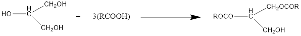

**روغن های ثابت، چربی ها، موم ها**

**مقدمه**

روغن‌های ثابت و چربی‌ها از نظر شیمیایی مشابه یکدیگر بوده ولی از لحاظ نقطه ذوب با هم تفاوت دارند. این نوع فرآورده‌ها شامل روغن ارشید، روغن زیتون، روغن کرچک و دیگر روغن‌های غیر فرار از مایع می‌باشند و از نظر شیمیایی استرهای اسیدهای چرب با زنجیر طولانی با گلیسرول (الکل تری هیدریک) هستند:

که در آن‌ها RCOOH یک اسید چرب از نوع CH3 (CH2)n COOH بوده و معمولا تعداد n بین 16 الی 18 می‌باشد. انواع مختلف اسیدهای چرب غیر اشباع با تعداد حدود 1 الی 4 اتصال مضاعف نیز ممکن است در آن‌ها وجود داشته باشد. هر چه محتوی اسید چرب غیر اشباع بیشتر باشد ویسکوزیته روغن کمتر است. چربی‌های حامل نظیر کره کاکائو یا پیه گوسفند نیز از نظر شیمیایی ساختمان تری گلیسریدی داشته ولی مقدار اسیدهای چرب اشباع آنان بیشتر است.

استانداردهای رسمی برای روغن‌های ثابت به قرار زیر است:

**1- اندیس اسید:** عبارتت است از مقدار (میلی گرم) هیدروکسید پتاسیم لازم برای خنثی نمودن اسیدهای آزاد موجود در یک گرم از ماده

**2-** **اندیس ید:** مقدار وزن ید که توسط 100 قسمت از ماده جذب می‌گردد. این اندیس نشانگر میزان غیر اشباع بودن فرآورده است.

**3- اندیس صابونی:** مقدار (میلی گرم) هیدروکسید پتاسیم لازم برای خنثی کردن اسیدهای چرب ناشی از هیدرولیز کامل یک گرم ماده این استاندارد نشانگر میزان آلودگی با سایر مواد غیر استری نظیر پارافین‌ها است. (B.P.1980 P.A.103) برای روغن‌های ثابت آزمایشات اختصاصی نیز وجود دارد که در این آزمایش به آن خواهیم پرداخت.

روغن‌های ثابت گیاهی اغلب به عنوان منابع غذایی در آندوسپرم دانه‌ها یافت می‌گردند (نظیر روغن آراشید که از بادام زمینی *Arachis hypogaea *تهیه می‌شود و یا روغن کرچک که از دانه‌های گیاه کرچک *Ricinus communis* به دست می‌آید).

استثناء در این مورد روغن زیتون می‌باشد که مستقیما از برون بر زیتون *Olea europaea* حاصل می‌گردد.

**موهای طبیعی:**

به صورت مخلوط بوده و دارای استرهای با وزن مولکولی زیاد و الکل‌های مونوهیدریک (CH3-(CH2)n- OH, n=12+) با اسیدهای چرب است. موها را به مقدار جزئی می‌توان در سطح اکثر گیاهان یافت. یک مثال عمده از موم‌های گیاهی موم کارنوبا Carnauba wax است (حاصل از یک نوع نخل به نام *Copernicia cerifera *که استر عمده آن میریسیل سروتات C26H53COOC30H61 می‌باشد. از موم‌های حیوانی می‌توان موم زنبور عسل، اسپرماستی و لانولین را نام برد. لانولین حاوی مقادیر زیادی کلسترول و یا استرول‌های وابسته (به صورت آزاد) و به صورت مخلوط با اسیدهای چرب با زنجیر طولانی) و الکل‌های خطی است.

**آزمایشات تخصصی:**

1- دو لوله آزمایش حاوی 1 میلی لیتر تتراکلروکربن، در اولی یک قطره روغن زیتون و در دومی یک قطره روغن برزک بریزید. آنگاه ز طریق بورت قطره قطره آب برم در هر یک از لوله ها افزوده و پس از هر افرایش لوله آزمایش را به خوبی تکان دهید. سرانجام مقدار حج آب برم لازم برای ایجاد رنگ دائمی دو لایه تحتانی را برای دو روغن یادداشت نمایید.

علت تفاوت حجم آب برم مصرفی را برای دو روغن زیر توضیح دهید.

روغن زیتون:............................. روغن برزک: ......................................

<u>این آزمایش به علت سمیت برم حذف گردیده است .</u>

**2- حلالیت روغن کرچک و روغن زیتون** را طبق روش زیر مقایسه کنیدو بصورت مثبت( حل میشود) و منفی ( حل نمی شود) در برگه گزارش دهید.

|  |  | روغن کرچک | روغن زیتون |
|:--:|----|----|----|
| A | **1** میلی لیتر روغن + **1** میلی لیتر اتانول مطلق |  |  |
| B | **1** میلی لیتر روغن + **1** میلی لیتر اتانول 90% |  |  |
| C | **2** میلی لیتر روغن+ **1** میلی لیتر اتردوپترول |  |  |
| D | **2** میلی لیتر روغن+ 4 میلی لیتر اتردوپترول |  |  |

**3- آزمایش تشخیص ویتامینA در روغن ماهی:**

5 قطره روغن ماهی را در 1 سی سی از محلول آماده اشباع شده تری گلومر آنتیموان حل نموده و رنگ حاصله را یاد داشت کنید . رنگ.....

4**- تشخیص روغن کنجد:**

2 میلی لیتر از روغن کنجد را با **1** سی سی از معرف آماده ساکارز 1% در اسید کلریدریک غلیظ ( زیر هود ) ، را در یک لوله آزمایش ریخته و حدود 10 ثانیه حرارت دهید .سپس رنگ حاصله در لایه اسیدی را مشاهده و یادداشت کنید.

رنگ لایه اسیدی ......

5- در موم زنبور عسل اغلب چربی ها، روغن ها و رزین ها به صورت مخلوط وجود دارند. ردیابی این قبیل مواد را میتوان توسط آزمایش زیر انجام داد:

5/1 گرم از موم را در بشر با 16 میلی لیتر محلول سود 8 درصد آنقدر بجوشانید تا موم کاملا" ذوب شود . بلافاصله محلول داغ را توسط پنبه صاف نموده و با اسید کلریدریک 3 نرمال محلول را اسیدی کنید و با کاغذPH ( رنگ قرمز) کنترل کنید. اگر در موم چربی ، اسیدهای چرب و یا رزین وجود داشته باشد رسوب تشکیل خواهد شد .

**توجه : تمام آزمایشات فوق می بایست در جا لوله ای قرار داده شود و در انتهای پایان کار به کارشناس آزمایشگاه تحویل داده شود تا نمره کار عملی ثبت گردد.**
