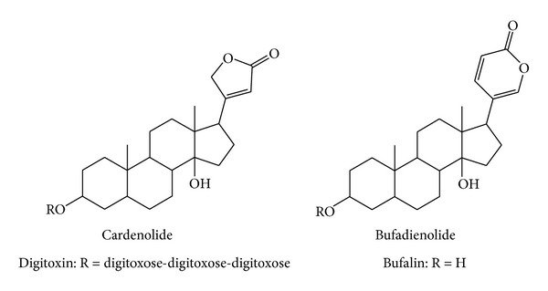
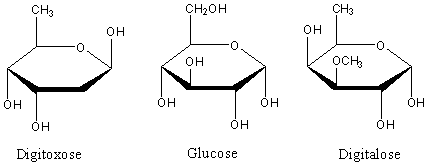

**گلیکوزیدهای قلبی**

**مقدمه**

گلیکوزیدها مواد آلی گیاهی می‌باشند که از یک بخش قندی و یک قسمت غیرقندی که معمولا آن را آگلیکون یا «ژنین» می‌نامند تشکیل یافته‌اند. در مولکول آن‌ها معمولا اتصال کربن قسمت قندی به کربن ژنین را از طریق اکسیژن صورت می‌گیرد که در نتیجه آنان را «o- گلوکزید» می‌نامند. ولی در بعضی موارد اتصال دو بخش یاد شده از طریق کربن به کربن است که به اختصار c- گلوکزید نامیده می‌شوند (مانند باربالوئین).

گلیکوزیدها در محیط اسیدی به آسانی هیدرولیز گردیده و قسمت قندی از آگلیکون جدا می‌گردد اما c- گلوکوزیدها نیاز به هیدرولیز اکسیداتیو توسط کلرورفریک برای جدا شدن دو بخش دارند.

برای استخراج گلوکزیدها روش خاصی وجود ندارد و روش بستگی به مواردی دارد که عبارتند از:

الف- ساختمان شیمیایی آگلیکون ب- پایداری مولکولی به طور کلی ج- این که آیا فعالیت بیولوژیکی مدنظر است د- این که آیا قسمت غیرفعال مولکول برای تشخیص شیمیایی مورد نیاز می‌باشد.

ژنین‌های گلوکزیدهای قلبی دارای ساختمان استروئیدی بوده و شبیه ساختمان اسیدهای صفراوی، ویتامینD و هورمون‌های جنسی می‌باشند. در مولکول آنان یک حلقه لاکتون غیر اشباع وجود دارد که ممکن است 5 کربنه و یا 6 کربنه باشند و در موقعیت کربن 17 به مولکول متصل شده‌اند.

قسمت قندی مولکول ممکن است دارای یک تا چهار مولکول باشد که به صورت زنجیر در موقعیت کربن شماره3 بخش غیرقندی به مولکول متصل شده‌اند و در نتیجه ممکن است یک سری از تترا، تری، دی و یا مونوگلوکزیدها پدید آیند. برخی از قندهای گلیکوزیدها از نوع عادی مانند گلوکز و یا رامنوز بوده ولی بقیه را قندهای دزوکسی تشکیل می‌دهند مانند دیژیتوکسوز (دزوکسی هگزوز)، دیژیتالوز (متیل اتر آنتاروز)، آنتیاروز (دزوکسی گلوکز).

کاردنولیدها را اکثرا در گیاهان تیره آپوسناسه و آگلپیاداسه می‌توان یافت و بوفادی انولیدها در تیره زنبق (مانند جنس Urginea) و بعضی از گیاهان تیره رانونکولاسه (نظیر جنس Hellebors) وجود دارند.

آزمایشات تشخیص گلیکوزیدهای قلبی بر اساس نوع قند و ژنین گلیکوزید استوار است. معرف‌هایی که برای آزمایش شیمیایی این قبیل گلیکوزیدها به کار می‌روند عبارتند از معرف Kedde (محلول الکلی 3، 5- دی نیتروبنزوئیک اسید در سود 1 نرمال) که بر روی حلقه لاکتون اثر می‌گذارد، معرف Libbermann (انیدرید استیک+ اسید سولفوریک) و معرف Carr- Price (تری کلرور آنتیموان+ انیدرید استیک) که اثرشان بر روی هسته استروئیدی است و معرف Keller-killiani (کلرورفریک+ اسید سولفوریک+ اسید استیک) که برای ردیابی قند دزوکسی در گلیکوزیدها مصرف می‌شود.

**جدا سازی و شناسایی گلیکوزیدهای قلبی**

**جداسازی** **گلیکوزیدهای قلبی دسته کاردنولیدها**

یک گرم از پودر گیاه خرزهره را با 10 سی سی اتانول 70 % در داخل ارلن مخلوط نموده و سر آن را با فویل پوشانده و به مدت 6دقیقه بر روی بن ماری قرار داده و سپس توسط پنبه آن را صاف نموده و به حاصل 30 سی سی آب مقطر و 15 سی سی استات سرب 20% را اضافه کنید و به مدت 10 دقیقه **<u>بطور ثابت</u>** بر روی میز کار خود قرار داده و سپس صاف نمایید. حاصل صافی می بایست محلول رنگی شفاف باشد آن را به قیف دکانتور منتقل نموده و با 10 سی سی محلول (کلروفرم – ایزو پروپانول3+2 )دکانته نموده و فاز آلی ( فاز پایینی) را جدا نموده و در ارلن نگه داری نمایید. دوباره به فاز بالایی باقیمانده در قیف دکانتور 10 سی سی محلول کلروفرم – ایزو پروپانول ( 3+ 2) دکانته نموده و مجددا" فاز آلی ( فاز پایینی) را جدا نموده و به ارلنی که فاز آلی قبلی قرار دارد اضافه کنید .

سپس ارلن حاوی فاز های آلی را به همراه دو عدد بوته چینی **خشک شده** نزد کارشناس آزمایشگاه برده تا سولفات سدیم بدون آب به آن اضافه و حاصل را به دو قسمت تقسیم نموده و به بوته های چینی منتقل ، تا دو آزمایش زیر برای شناسایی گلوکزیدهای قلبی انجام گردد.

**شناسایی** **گلوکزیدهای قلبی دسته کاردنولیدها**

**تهیه معرف بالجت**

**9.5 **سی سی از محلول یک درصد پیکریک و 0.5 سی سی سود 10 % را با یکدیگر مخلوط کرده و استفاده می نماییم . این معرف می بایستی تازه تهیه شود. ( این معرف را خودتان آماده کنید)

**الف) واکنش بالجت (Baljet- Reaction)**

محلول تهیه شده داخل <u>بوته اول</u> را روی بن ماری گذاشته و آنقدر تغلیظ می نماییم که به اندازه 2 قطره در داخل بوته باقی بماند، 3 سی سی متانول به آن اضافه نموده و حل می نماییم و سپس 3 میلی لیتر از معرف بالجت **زرد** رنگ را به آن اضافه می نماییم و خوب مخلوط می کنیم.

با توجه به وجود کاردنولیدها در محلول مورد آزمایش ، رنگ **نارنجی** ایجاد می شود که برای چند ساعتی پایدار می ماند.

**ب) واکنش کد ( Kedde- Reaction)**

<u>بوته دوم</u> را مانند روش قبل تغلیظ نموده و به باقیمانده 2 سی سی محلول 2 درصد 3 و 5 دی نیتروبنزوئیک اسید اضافه کرده و خوب مخلوط کنید سپس 2 سی سی پتاس 1 نرمال به آن اضافه نمایید.

با توجه به وجود کاردنولیدها ایجاد رنگ **ارغوانی** می نماید.

**ج) آزمایش ( Keller- Killiani) برای رد یابی قند دیژیتوکسوز**

ابتدا یک گرم از برگ خشک و خرد شده گیاه دیژیتال ( گیاه خرزهره) را با 15 میلی لیتر الکل 70% در داخل ارلن مخلوط نموده و سر آن را با فویل پوشانده و به مدت 5 دقیقه بر روی بن ماری قرار داده و سپس توسط پنبه آن را صاف نموده و به حاصل 10 سی سی آب و 2 سی سی استات سرب 20% را اضافه نموده 5 دقیقه صبر کنید و سپس صاف نمایید. محلول را به قیف دکانتور انتقال داده و 5 میلی لیتر کلروفرم به آن اضافه نموده و فرصت دهید تا دو لایه از هم جدا شوند. لایه کلروفرمی ( فاز پایین) را جدا نموده و به بوته چینی انتقال داده و روی بن ماری تا حد خشکی ( 2 قطره) تغلیظ نمایید . پس از سرد شدن بوته چینی **<u>با احتیاط</u>** 3 میلی لیتر اسید استیک گلاسیال غلیظ ( زیر هود) و 3 قطره کلروفریک 2 % به آن اضافه کنید

داخل لوله آزمایش تمییز و خشک با احتیاط 2 سی سی **اسید سولفوریک غلیظ**( زیر هود) ریخته و محلول حاصل را توسط قطره چکان **<u>خیلی آرام</u>** از طریق دیواره لوله به لوله آزمایش حاوی 2 سی سی **اسید سولفوریک غلیظ** منتقل کنید.

اگر خوب استخراج را انجام داده باشید ،در حد فاصل بین دولایه ،**یک حلقه قهوه ای رنگ مایل به ارغوانی** تشکیل می گردد که نشان می دهد آزمایش را با دقت انجام داده اید.

در انتها تمامی نتایج را به کارشناس آزمایشگاه نشان دهید.
